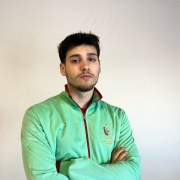

João Neiva, A108579

## Resumo 

### Este trabalho consiste em criar um analisador léxico e sintático para expressões aritméticas simples, capazes de lidar com números inteiros, operações de soma, subtração, multiplicação, divisão e parênteses.